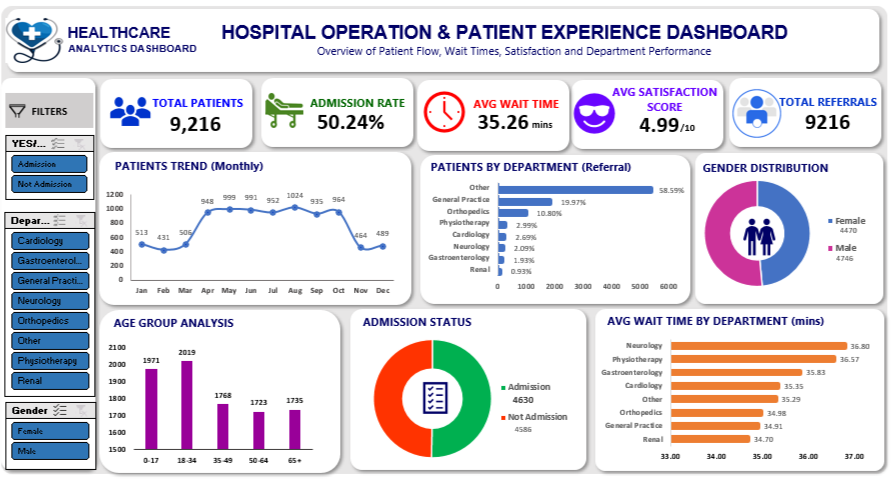

# 🏥 Hospital Operation & Patient Experience Dashboard

<div align="center">


**An interactive Excel dashboard analyzing hospital patient flow, wait times, satisfaction scores, and department performance across 9,216 patients.**

[📊 View Dashboard](dashboard_screenshot.PNG) • [📋 Business Questions](#business-questions) • [🛠 Tools Used](#tools-used) • [📁 Dataset](#dataset-overview)

</div>

---

## 📌 Table of Contents

- [Project Overview](#-project-overview)
- [Dashboard Preview](#-dashboard-preview)
- [Business Questions Answered](#-business-questions-answered)
- [Key KPIs](#-key-kpis)
- [Dataset Overview](#-dataset-overview)
- [Data Cleaning Steps](#-data-cleaning-steps)
- [Step-by-Step Build Guide](#-step-by-step-build-guide)
- [Charts & Visualizations](#-charts--visualizations)
- [Key Insights](#-key-insights)
- [Tools Used](#-tools-used)
- [Project Structure](#-project-structure)
- [How to Use](#-how-to-use)
- [Resume Description](#-resume-description)
- [Connect with Me](#-connect-with-me)

---

## 📖 Project Overview

This project presents a **Hospital Operation & Patient Experience Dashboard** built entirely in **Microsoft Excel**. The dashboard provides a comprehensive overview of patient flow, wait times, satisfaction scores, and department-level performance metrics to help hospital administrators make **data-driven decisions**.

### 🎯 Project Goals
- Monitor total patient admissions and referral patterns
- Analyze average wait times across departments
- Track patient satisfaction scores
- Understand age group distribution of patients
- Compare admission vs non-admission rates
- Identify which departments have the highest wait times

---

## 🖼 Dashboard Preview

> Dashboard built in Microsoft Excel with interactive slicers, KPI cards, and 6+ chart types.



### Dashboard Features:
- ✅ **Interactive Slicers** — Filter by Admission Status, Department, Gender
- ✅ **KPI Cards** — Total Patients, Admission Rate, Avg Wait Time, Satisfaction Score, Total Referrals
- ✅ **6 Chart Types** — Line, Bar, Donut, Column, Horizontal Bar, Stacked Bar
- ✅ **Dark Professional Theme** — Clean layout with consistent color scheme
- ✅ **Dynamic Filters** — All charts update automatically with slicer selections

---

## ❓ Business Questions Answered

| # | Business Question | Chart Used | Answer |
|---|---|---|---|
| 1 | What is the total number of patients? | KPI Card | **9,216 patients** |
| 2 | What is the hospital admission rate? | KPI Card | **50.24%** |
| 3 | What is the average patient wait time? | KPI Card | **35.26 minutes** |
| 4 | How satisfied are patients on average? | KPI Card | **4.99 / 10** |
| 5 | How have patient visits trended monthly? | Line Chart | Peak in Jul (1,024), low in Jan (513) |
| 6 | Which department receives most referrals? | Bar Chart | **Other (58.59%)**, then General Practice (19.97%) |
| 7 | What is the gender distribution? | Donut Chart | Female: 4,470 · Male: 4,746 |
| 8 | Which age group visits most frequently? | Column Chart | **18–34 (2,019 patients)** |
| 9 | What is the admission vs non-admission split? | Donut Chart | Admission: 4,630 · Not Admission: 4,586 |
| 10 | Which department has the longest wait time? | Horizontal Bar | **Neurology (36.80 mins)** |
| 11 | Which department has the shortest wait time? | Horizontal Bar | **Renal (34.70 mins)** |

---

## 📊 Key KPIs

```
┌─────────────────┬──────────────────┬─────────────────┬───────────────────┬──────────────────┐
│  TOTAL PATIENTS │  ADMISSION RATE  │  AVG WAIT TIME  │  AVG SATISFACTION │  TOTAL REFERRALS │
│     9,216       │     50.24%       │   35.26 mins    │     4.99 / 10     │      9,216       │
└─────────────────┴──────────────────┴─────────────────┴───────────────────┴──────────────────┘
```

---

## 📁 Dataset Overview

| Field | Description | Type |
|---|---|---|
| `Patient_Id` | Unique patient identifier | Text |
| `Admission_Date` | Date of hospital visit | Date |
| `Admission_Time` | Time of hospital visit | Time |
| `Gender` | Patient gender (Male/Female) | Text |
| `Age` | Patient age in years | Number |
| `Race` | Patient ethnicity | Text |
| `Department` | Referring department | Text |
| `Admission_Flag` | Admitted or Not Admitted | Text |
| `Satisfaction_Score` | Patient rating (1–10) | Number |
| `Wait_Time` | Time waited in minutes | Number |
| `Age_Group` | Age bracket (0–17, 18–34, etc.) | Text |
| `Admission_Indicator` | Binary flag (1=Admitted, 0=Not) | Number |

### Dataset Stats
- **Total Rows:** 9,219
- **Total Columns:** 18
- **Date Range:** 2024
- **Departments:** Cardiology, Gastroenterology, General Practice, Neurology, Orthopedics, Physiotherapy, Renal, Other

---

## 🧹 Data Cleaning Steps

### Step 1 — Import Data
```
1. Open Excel → Data → From Text/CSV or open .xlsx directly
2. Go to first sheet: healthcare_analytics_patient_fl
3. Press Ctrl + T to convert to Excel Table
4. Name table: Patient_Data
```

### Step 2 — Remove Duplicates
```
1. Select entire table
2. Data tab → Remove Duplicates
3. Keep: Patient_Id + Admission_Date combined
4. Note number of rows removed
```

### Step 3 — Handle Blank/Null Values
```
1. Home → Find & Select → Go To Special → Blanks
2. Satisfaction_Score: Some nulls are valid (patient didn't rate)
3. Department: Fill "Not Referred" where blank
4. Age: Remove rows where Age is blank (invalid records)
```

### Step 4 — Fix Data Types
| Column | Correct Format | Fix |
|---|---|---|
| Admission_Date | Date (YYYY-MM-DD) | Format Cells → Date |
| Wait_Time | Number (1 decimal) | Format Cells → Number |
| Satisfaction_Score | Number (2 decimal) | Format Cells → Number |
| Admission_Indicator | Number (0 or 1) | Format Cells → Number |
| Age | Whole Number | Format Cells → Number, 0 decimals |

### Step 5 — Standardize Text Values
```
Department Column — verify only these values exist:
  → Cardiology
  → Gastroenterology
  → General Practice
  → Neurology
  → Orthopedics
  → Physiotherapy
  → Renal
  → Not Referred

Use Find & Replace (Ctrl+H) to fix any typos
Example: "PhysiNot Referredapy" → "Physiotherapy"
```

### Step 6 — Add Helper Columns
| New Column | Formula | Purpose |
|---|---|---|
| Age_Group | Already exists | Group ages for analysis |
| Admission_Indicator | `=IF([@Admission_Flag]="Admission",1,0)` | Binary for rate calculation |
| Month_Name | `=TEXT([@Admission_Date],"MMM")` | Month label for trend chart |
| Month_Num | `=MONTH([@Admission_Date])` | Sort months correctly |

### Step 7 — Validate Key Metrics
```excel
Total Patients:      =COUNTA(Patient_Data[Patient_Id])       → Should be 9,216
Admission Rate:      =AVERAGE(Patient_Data[Admission_Indicator]) → Should be ~50.24%
Avg Wait Time:       =AVERAGE(Patient_Data[Wait_Time])        → Should be ~35.26
Avg Satisfaction:    =AVERAGE(Patient_Data[Satisfaction_Score]) → Should be ~4.99
```

---

## 🔨 Step-by-Step Build Guide

### PHASE 1 — Setup Workbook Structure

```
Create these sheets in order:
1. Raw_Data         → Original imported data (do not edit)
2. Clean_Data       → Cleaned and formatted data
3. Analysis         → All Pivot Tables live here
4. Dashboard        → Final visual dashboard
```

### PHASE 2 — Build Pivot Tables (Analysis Sheet)

#### Pivot Table 1: Monthly Patient Trend
```
Rows:    Month_Name
Values:  Count of Patient_Id
Sort:    By Month_Num ascending
Result:  Jan=513, Feb=431, Mar=506 ... Dec=489
```

#### Pivot Table 2: Patients by Department (Referral)
```
Rows:    Department
Values:  Count of Patient_Id
Sort:    Largest to Smallest
Result:  Other=58.59%, General Practice=19.97%, Orthopedics=10.80%
```

#### Pivot Table 3: Gender Distribution
```
Rows:    Gender
Values:  Count of Patient_Id
Result:  Female=4,470, Male=4,746
```

#### Pivot Table 4: Age Group Analysis
```
Rows:    Age_Group
Values:  Count of Patient_Id
Sort:    By Age_Group (0-17, 18-34, 35-49, 50-64, 65+)
Result:  18-34=2,019, 0-17=1,971, 35-49=1,768, 50-64=1,723, 65+=1,735
```

#### Pivot Table 5: Admission Status
```
Rows:    Admission_Flag
Values:  Count of Patient_Id
Result:  Admission=4,630, Not Admission=4,586
```

#### Pivot Table 6: Avg Wait Time by Department
```
Rows:    Department
Values:  Average of Wait_Time
Sort:    Largest to Smallest
Result:  Neurology=36.80, Physiotherapy=36.57, Gastroenterology=35.83...
```

### PHASE 3 — Create KPI Cards (Dashboard Sheet)

```
Step 1: Design a rectangle shape for each KPI card
Step 2: Add text boxes inside with:
        - Label (small, light color)
        - Value (large, bold, white)
        - Icon (Insert → Icons)

KPI 1: TOTAL PATIENTS
Formula: =COUNTA(Clean_Data[Patient_Id])
Format:  #,##0

KPI 2: ADMISSION RATE
Formula: =COUNTIF(Clean_Data[Admission_Flag],"Admission")/COUNTA(Clean_Data[Patient_Id])
Format:  0.00%

KPI 3: AVG WAIT TIME
Formula: =AVERAGE(Clean_Data[Wait_Time])
Format:  0.00 "mins"

KPI 4: AVG SATISFACTION SCORE
Formula: =AVERAGE(Clean_Data[Satisfaction_Score])
Format:  0.00"/10"

KPI 5: TOTAL REFERRALS
Formula: =COUNTA(Clean_Data[Patient_Id])
Format:  #,##0
```

### PHASE 4 — Build All 6 Charts

#### Chart 1: Line Chart — Monthly Patient Trend
```
1. Select Pivot Table 1 data
2. Insert → Line Chart → Line with Markers
3. Customize:
   - Title: "PATIENTS TREND (Monthly)"
   - Line Color: Blue (#1976D2)
   - Marker: Circle, filled
   - Remove gridlines
   - Add data labels on peak points
```

#### Chart 2: Horizontal Bar Chart — Patients by Department
```
1. Select Pivot Table 2 data
2. Insert → Bar Chart → Clustered Bar (horizontal)
3. Customize:
   - Title: "PATIENTS BY DEPARTMENT (Referral)"
   - Bar Color: Teal (#00897B)
   - Add % data labels
   - Sort: Largest to Smallest
   - Remove legend
```

#### Chart 3: Donut Chart — Gender Distribution
```
1. Select Pivot Table 3 data
2. Insert → Pie Chart → Doughnut
3. Customize:
   - Title: "GENDER DISTRIBUTION"
   - Colors: Pink for Female, Blue for Male
   - Hole size: 60%
   - Add legend: Female 4,470 | Male 4,746
   - Add center label with total
```

#### Chart 4: Column Chart — Age Group Analysis
```
1. Select Pivot Table 4 data
2. Insert → Column Chart → Clustered Column
3. Customize:
   - Title: "AGE GROUP ANALYSIS"
   - Colors: Alternating Purple and Blue
   - Add data labels on top of bars
   - X-axis: Age group labels
   - Remove gridlines
```

#### Chart 5: Donut Chart — Admission Status
```
1. Select Pivot Table 5 data
2. Insert → Pie Chart → Doughnut
3. Customize:
   - Title: "ADMISSION STATUS"
   - Colors: Green for Admission, Orange for Not Admission
   - Add legend with counts
   - Hole size: 55%
```

#### Chart 6: Horizontal Bar Chart — Avg Wait Time by Department
```
1. Select Pivot Table 6 data
2. Insert → Bar Chart → Clustered Bar (horizontal)
3. Customize:
   - Title: "AVG WAIT TIME BY DEPARTMENT (mins)"
   - Bar Color: Orange (#F57C00)
   - Add data labels showing exact minutes
   - Axis scale: Start from 33 (not 0) to show differences clearly
   - Sort: Largest wait time at top
```

### PHASE 5 — Add Interactive Slicers

```
Step 1: Click any Pivot Table
Step 2: PivotTable Analyze → Insert Slicer
Step 3: Add these slicers:
        ✅ Admission_Flag (YES/NO or Admission/Not Admission)
        ✅ Department
        ✅ Gender

Step 4: Connect slicers to ALL Pivot Tables:
        Right-click Slicer → Report Connections
        Check ALL Pivot Tables → OK

Step 5: Style slicers:
        Slicer tab → choose dark style matching dashboard
        Resize to fit sidebar area
```

### PHASE 6 — Dashboard Layout & Design

```
Background:
1. Select all cells → Fill Color → Dark Blue (#0D1B2A)
2. Remove gridlines: View → uncheck Gridlines

Header Section:
1. Insert → Shapes → Rectangle
2. Add hospital logo/icon
3. Title: "HOSPITAL OPERATION & PATIENT EXPERIENCE DASHBOARD"
4. Subtitle: "Overview of Patient Flow, Wait Times, Satisfaction and Department Performance"

Layout Grid (approximate):
┌─────────────────────────────────────────────┐
│  LOGO    TITLE                    SUBTITLE  │
├──────┬──────┬──────┬──────┬────────────────┤
│ KPI1 │ KPI2 │ KPI3 │ KPI4 │     KPI5      │
├──────┴──────┴──────┴──────┴────────────────┤
│  SLICERS  │   LINE CHART   │  BAR CHART    │
│           │  (Monthly)     │  (Dept Ref.)  │
│           ├────────────────┤               │
│           │    DONUT       │               │
│           │  (Gender)      │               │
├───────────┼────────────────┼───────────────┤
│  COL CHART│  DONUT CHART   │  HORIZ BAR   │
│ (Age Grp) │ (Admission)    │  (Wait Time) │
└───────────┴────────────────┴───────────────┘
```

---

## 📈 Charts & Visualizations

| Chart | Type | Business Question | Key Finding |
|---|---|---|---|
| Monthly Patient Trend | Line Chart | How do visits trend monthly? | July peak (1,024 patients) |
| Patients by Department | Horizontal Bar | Which dept gets most referrals? | Other category dominates (58.59%) |
| Gender Distribution | Donut Chart | Male vs Female split? | Slight male majority (4,746 vs 4,470) |
| Age Group Analysis | Column Chart | Which age group visits most? | 18–34 leads with 2,019 patients |
| Admission Status | Donut Chart | Admitted vs not admitted? | Near equal split (50.24% admitted) |
| Wait Time by Dept | Horizontal Bar | Slowest department? | Neurology highest at 36.80 mins |

---

## 💡 Key Insights

```
1. PATIENT VOLUME
   → 9,216 total patients with consistent monthly growth
   → July peak (1,024) suggests seasonal demand spike
   → January lowest (513) — possible post-holiday dip

2. ADMISSIONS
   → Near-perfect 50/50 split (50.24% admitted)
   → 4,630 admitted vs 4,586 not admitted
   → Suggests strong triage efficiency

3. WAIT TIMES
   → Neurology has highest wait (36.80 mins) — needs resource review
   → Renal has lowest wait (34.70 mins) — benchmark for other depts
   → All departments within 2-minute range (34.70 to 36.80)

4. PATIENT SATISFACTION
   → Average score: 4.99/10 — room for improvement
   → Possible correlation: higher wait time = lower satisfaction

5. DEMOGRAPHICS
   → 18–34 age group most frequent visitors (2,019 patients)
   → 65+ age group significant (1,735) — senior care demand
   → Gender split is nearly even (Female: 48.5%, Male: 51.5%)

6. REFERRALS
   → 58.59% classified as "Other" — suggests unclear referral tracking
   → General Practice: 19.97% — main formal referral source
   → Orthopedics: 10.80% — third highest referral department
```

---

## 🛠 Tools Used

| Tool | Purpose |
|---|---|
| **Microsoft Excel** | Dashboard development, data cleaning, visualization |
| **Pivot Tables** | Data aggregation and summarization |
| **Slicers** | Interactive dashboard filtering |
| **Excel Charts** | Line, Bar, Column, Donut chart creation |
| **Conditional Formatting** | Data validation and visual highlighting |
| **Excel Shapes & Icons** | KPI card design and dashboard layout |
| **Excel Formulas** | KPI calculations (AVERAGE, COUNTIF, COUNTA) |

---

## 📂 Project Structure

```
Healthcare-Analytics-Dashboard/
│
├── 📊 healthcare_analytics_patient_flow_data.xlsx
│   ├── Sheet 1: Raw_Data              → Original imported data
│   ├── Sheet 2: healthcare_analytics  → Cleaned data with helper columns
│   ├── Sheet 3: Analysis              → All Pivot Tables
│   └── Sheet 4: Dashboard             → Final interactive dashboard
│
├── 🖼 dashboard_screenshot.png         → Dashboard preview image
├── 📄 README.md                        → This documentation file
└── 📋 data_dictionary.md               → Column descriptions
```

---

## 🚀 How to Use

### Prerequisites
- Microsoft Excel 2016 or later (for full slicer support)
- OR WPS Office (free alternative)

### Steps to Run
```
1. Download the file:
   healthcare_analytics_patient_flow_data.xlsx

2. Open in Microsoft Excel

3. Go to the "Dashboard" tab

4. Use the slicers on the left side to filter:
   → YES/NO (Admission Status)
   → Department (Cardiology, Neurology, etc.)
   → Gender (Male/Female)

5. All charts update automatically with your selections

6. To reset filters:
   Click the filter icon on each slicer → Clear Filter
```

---

## 📋 Key Formulas Used

```excel
-- Total Patients
=COUNTA(healthcare_analytics_patient_fl[Patient_Id])

-- Admission Rate
=COUNTIF(healthcare_analytics_patient_fl[Admission_Flag],"Admission")
 /COUNTA(healthcare_analytics_patient_fl[Patient_Id])

-- Average Wait Time
=AVERAGE(healthcare_analytics_patient_fl[Wait_Time])

-- Average Satisfaction Score
=AVERAGEIF(healthcare_analytics_patient_fl[Satisfaction_Score],"<>")

-- Department with Max Wait Time
=INDEX(dept_range, MATCH(MAX(waittime_range), waittime_range, 0))

-- Age Group Count
=COUNTIF(healthcare_analytics_patient_fl[Age_Group], "18-34")
```

---

## 📝 Resume Description

> **Hospital Operation & Patient Experience Dashboard | Microsoft Excel | Healthcare Analytics**
>
> - Analyzed patient flow data of **9,216 patients** to derive actionable insights on hospital operations and patient experience metrics
> - Designed an **interactive KPI dashboard** tracking Admission Rate (50.24%), Avg Wait Time (35.26 mins), and Satisfaction Score (4.99/10) with dynamic slicers for Department, Gender, and Admission Status
> - Visualized **monthly patient trends, age group distribution, gender analysis, referral breakdown**, and department-wise wait time comparison using 6 chart types
> - Identified that **Neurology has the highest wait time (36.80 mins)** and proposed resource optimization strategies to improve patient throughput
> - Delivered data-driven insights to support hospital management in improving **patient outcomes and operational efficiency**

---

## 🏷️ Skills Demonstrated

`Microsoft Excel` `Data Cleaning` `Data Analysis` `Dashboard Design` `Data Visualization` `KPI Reporting` `Pivot Tables` `Slicers` `Healthcare Analytics` `Conditional Formatting` `Storytelling with Data` `Business Intelligence`

---

## 📊 Data Source

- **Dataset:** Healthcare Analytics Patient Flow Data
- **Domain:** Healthcare / Hospital Operations
- **Records:** 9,219 patient records
- **Period:** 2024
- **Source:** Kaggle / Synthetic Hospital Data

---

## 🤝 Connect with Me

> If you found this project helpful, please ⭐ star this repository!

[
[](https://github.com/yourusername)
[](https://yourportfolio.com)

---

<div align="center">

**Made with ❤️ using Microsoft Excel**

*© 2026 | Data Analyst Portfolio Project*

</div>

